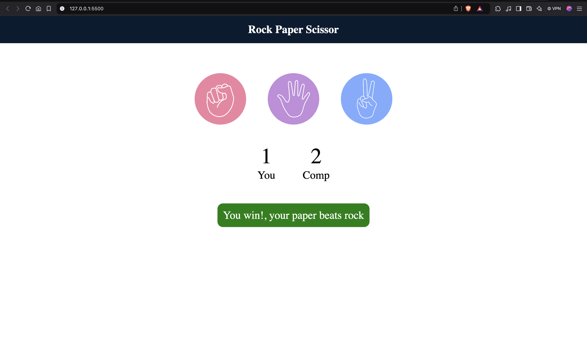

# Stone Paper Scissors Game

This is a simple Stone Paper Scissors game built using HTML, CSS, and JavaScript. It allows the user to select one of the three options (Stone, Paper, Scissors) and plays against the computer. The score is displayed as the game progresses.

## Features

- Displays three logos: Stone, Paper, and Scissors.
- Allows the player to choose an option from the three.
- Shows the result of each round (win, lose, or draw).
- Tracks and displays the total score of both the player and the computer.
- The game continues until the player chooses to stop or refresh the page.

## Preview


## Technologies Used

- **HTML** for the structure of the game.
- **CSS** for the styling and layout.
- **JavaScript** for game logic and interactivity.


## Installation

To run this project locally, follow these steps:

1. Clone this repository:
    ```bash
    git clone 
    ```

2. Navigate to the project directory:
    ```bash
    cd Stone-Paper-Scissor
    ```

3. Open the `index.html` file in your browser:
    ```bash
    open index.html
    ```

## Usage

1. Open the `index.html` file in a browser.
2. Players will take turn by clicking on the desired option.
3. The game will automatically detect the winner or declare a draw if both chooses the same option.
4. The game will keep track of the score in current session until now.
4. To restart the game, simply reload the page.

## Contributions

Feel free to fork this repository and contribute! You can help by:

- Reporting bugs.
- Improving the design or UX.
- Adding some additional features if needed.


## Author
Aryan Panchal

GitHub: [AryanP107](https://github.com/AryanP107)
<br>
Email: aryanpanchal107@gmail.com


## Contact
If you have any questions or suggestions, feel free to open an issue or contact me at [aryanpanchal07@gmail.com].
